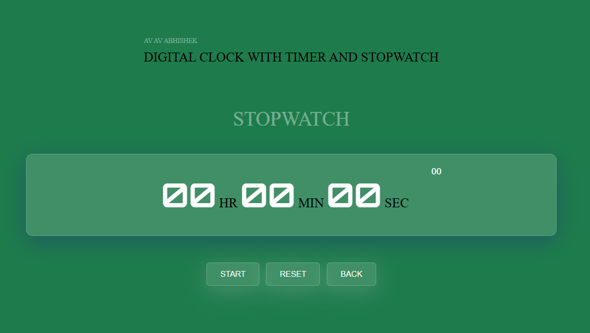

# Prodigy_Web-Development
## 📖 Task 2 - Stopwatch web Application

 <b>Stopwatch project</b>, designed as a part of internship  Web Development and Designing </b>,is a dynamic website which can be used to perform operations like:
<ul>
  <li>Start</li>
  <li>Stop</li>
  <li>Reset</li>
</ul>
 
A Countdown <b>Timer</b> is also being made as a part of this project, which is set for the event of Diwali and it restarts again once the event occurs, for the same event in upcoming year.

## 📓 Tools used
IDE : VS Code   
Front-End
<ul>
  <li>HTML</li>
  <li>CSS</li>
  <li>JS</li>
</ul>

 

## 👀 Screenshots

 

 

## ✍ Author

- [Abhishek Kumar](https://github.com/Abhishek080203)

 

## 📌 Features / Contributions
 - Any contributions you make are *greatly appreciated*
 - Would be glad to hear about *new features* to add in the website.

